# De quoi on parle ?


```{r}
#| label: intro
#| 
library(gtsummary)
library(ggplot2)
library(epiDisplay)
library(knitr)
library(kableExtra)
library(tidyverse)
library(janitor)

tt <- read_delim("patients.csv",show_col_types = FALSE) |> 
  drop_na(escarrej) |> 
  clean_names()
```


## Une idée, une thèse :
<BR>
  
> **Un sujet** Facteurs de risque d'escarre en réanimation<br>

> **Une question** État avant ?<br>

> **Un critère** Alitement prolongé (> 7j)<br>

> **Des outils** inadaptés

## Au travail !

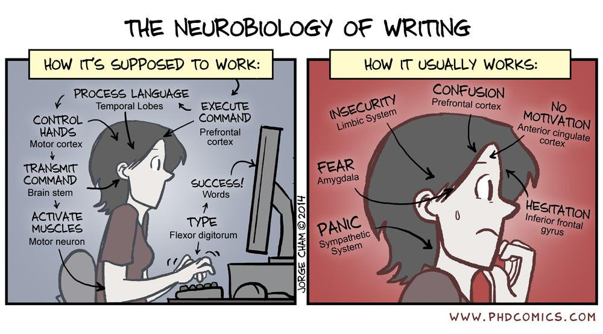


## Ordre du travail{.smaller}


```{r ordre}
nn <- 1:7
tr <- c("Bibliographie","Définir la question","Écrire le protocole","Recueil des données","Analyse interne","Analyse externe","Finir de rédiger")
ch <- c("Bibliographie","Introduction","Matériel & Méthodes"," ","Résultats","Discussion","Introduction")
dd <- data.frame(nn,tr,ch)
  kable(dd,
  col.names = c(" ","Travail", "Chapitre")) %>% 
 kable_styling(bootstrap_options = "striped", full_width = TRUE,
position = "center")
```


## Pressure Ulcer ICU

&nbsp;

:::: {.columns}

::: {.column width="48%"}
 
:::

::: {.column width="50%} 
**GOOGLE**
7 640 000  références

**GOOGLE SCHOLAR**
34 000 références

**MEDLINE**
679 références

**+ filtres**
176 références
:::

::::

# Que lire ?


## Article original

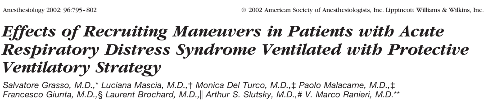

- Le plus intéressant
- Présente les résultats d'un travail original
- *Proposé par l'auteur à la revue*
- Souvent très (trop ?) pointu
 

## Proposé par l'auteur ?

&nbsp;

**Et si on changeait les critères ?**

&nbsp;

:::{.callout-tip}
## ClinicalTrial.gov

- Dépôt des points principaux d'un essai **avant le début de l'étude**
- Quasi obligatoire
:::


## Revue de la littérature {.smaller}
**Comparison of early versus late initiation of renal replacement therapy in critically ill patients with acute kidney injury: a systematic review and meta-analysis.**\n Critical Care 2011, 15:R72

&nbsp;
  
 **Conclusion** Earlier institution of RRT in critically ill patients with AKI may have a beneficial impact on survival. However, this conclusion is based on heterogeneous studies of variable quality and only two randomized trials. In the absence of new evidence from suitably-designed randomized trials, a definitive treatment recommendation cannot be made.


## Méta-analyse
  <BR>
  
  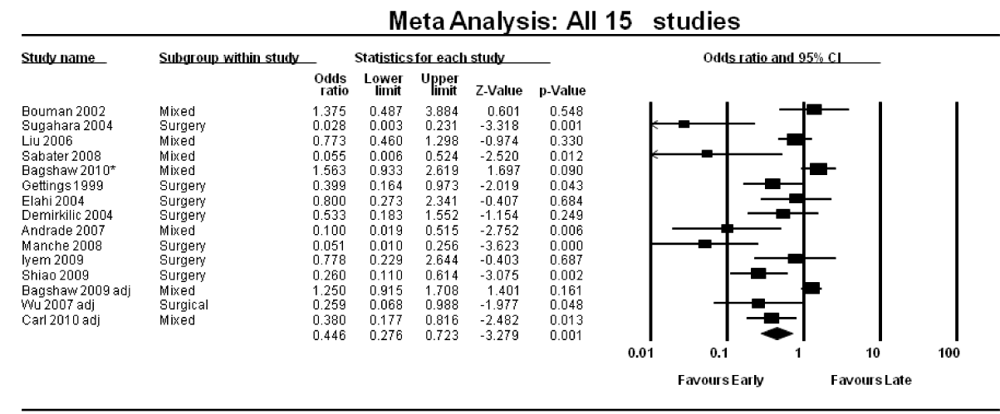 


## Conférence de consensus

### Recommendations Formalisées d'experts

&nbsp;
  


  
- Revue de la littérature qui se veut exhaustive
- Plusieurs auteurs donc plus objective ?
- Mises à jour prévues.

&nbsp;

**Evidence Based Medicine**

# Niveaux de preuve {.smaller}
  
```{r}
aa <- 1:5
dd <- c("Grands essais comparatifs randomisés avec résultats méthodologiquement indiscutables",
        "Petits essais comparatifs randomisés et grands essais avec résultats incertains",
        "Essais comparatifs non randomisés avec groupe contrôle contemporain, suivis de cohortes",
        "Essais comparatifs non randomisés avec groupes contrôles historiques, études cas-témoin",
        "Pas de groupe contrôle, essais contrôlés sur des critères intermédiaires, séries de patients, consensus professionnels, opinions d'experts")
nn <- c("Niveau A", "Niveau B", "Niveau B", "Niveau B", "Niveau C")
tibble(aa,dd,nn) |> 
 kable(
  col.names = c(" "," ", " ")) %>% 
 kable_styling(bootstrap_options = "striped", full_width = TRUE,
position = "center")
  
```

## Conférence d'experts

### La conf. de consensus du pauvre
<BR>
  
::::{.columns}
:::{.column width="60%"} 
 
- Que valent les *experts* ???
- **Niveau C**
:::
:::{.column width="39%"}
  <BR>
 
:::
::::

## Où chercher ?


### MEDLINE

#### Base de donnée bibliographique sur :

- la médecine **PUBMED**
- surtout le génome **PUBGEN**
  

## Système de recherche
  
::::{.columns}
:::{.column width="60%"} 
 
&nbsp;

### Descripteurs MESH
- Plus complexe, plus précise.

### par Mots-clefs
*Méthode par défaut*

- Rapide, simple
- Mots clefs ?
:::
:::{.column width="39%"} 

  
:::
::::

## MEDLINE


## MEDLINE
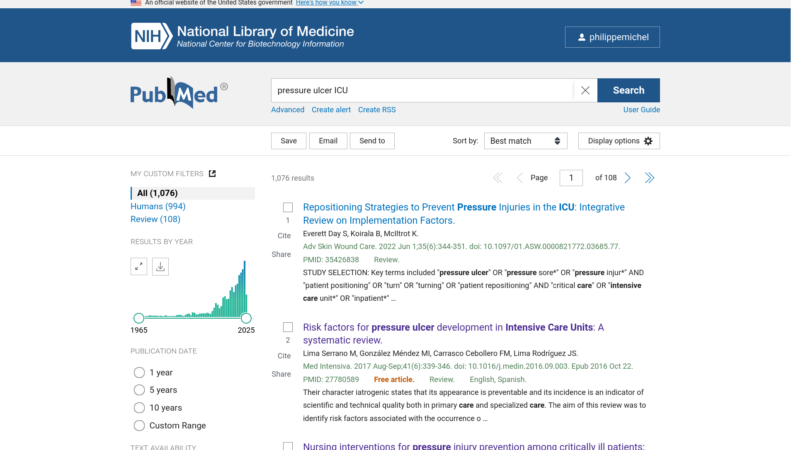

## EN FRANÇAIS


## GOOGLE SCHOLAR


## ZOTERO


## ?
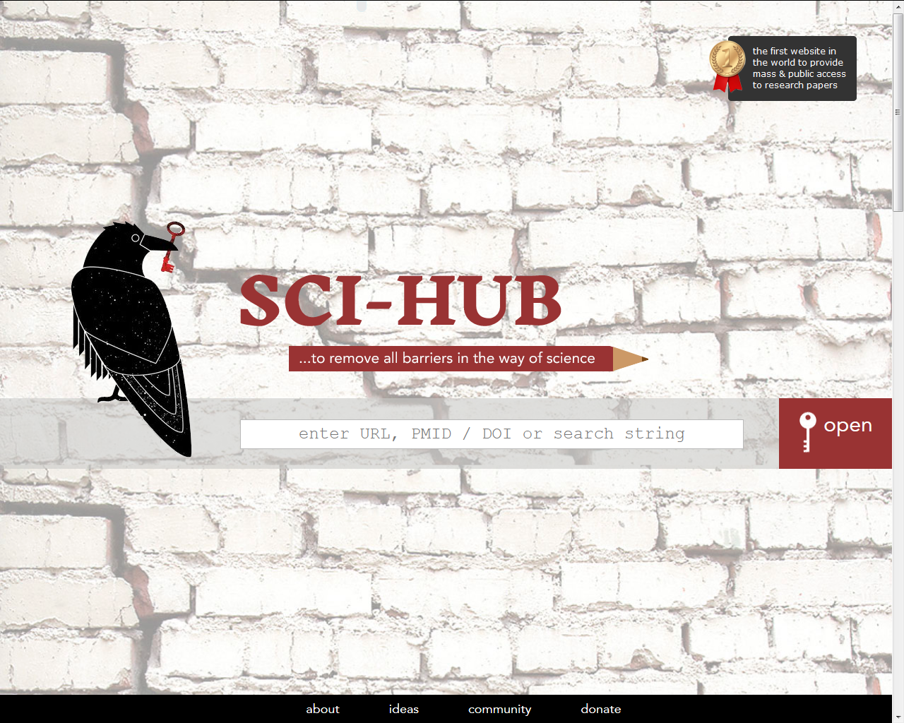

## Dernier contrôle

&nbsp;
  
::::{.columns}
:::{.column width="48%"} 


 
:::
:::{.column width="48%"} 

### Tout vous paraît correct ?
  
Il vous reste deux dernières chances
  
- **Correspondance**
- **Éditorial**
:::
::::
 
# Quelle étude ?

## Études contrôlées
  
### Tout est sous contrôle
  
- Nb de patients
- Qui reçoit quoi
- Les mesures, surveillances
- &hellip;

## Randomisé en double aveugle

#### BMJ 2003;327:1459

:::: {.columns}

::: {.column width="40%"}
  
:::

::: {.column width="60%"}
 Parachute use to prevent death and major trauma related to gravitational challenge: systematic review of randomised controlled trials
:::
::::

## Études contrôlées {.smaller}

:::{.callout-warning icon="false"}
## Études de molécules
**ÉTUDE RANDOMISÉE CONTRE &hellip; EN DOUBLE AVEUGLE**
:::
&nbsp;

:::{.callout-tip icon="false"}
## Autres modalités de traitement
Études randomisée en simple aveugle&hellip;
:::
&nbsp;

:::{.callout-caution icon="false"}
## Méthodes diagnostiques
Procédures spécifiques
:::


## Études observationnelles
  
- Suivi de population (cohorte)
- Études cas / témoins
- Enquètes **one day**
- Sondages
- Études rétrospectives


## Un peu d'aide&hellip; {.smaller}
  
### Thérapeutique
> **CONSORT** CONsolidated Standards Of Reporting Trial

### Diagnostic
> **STARD** Statement for Reporting Studies of Diagnostic Accurary

### Études observationnelles 
> **STROBE** Strengthening the Reporting of Observational Studies in Epidemiology


## STROBE
  
  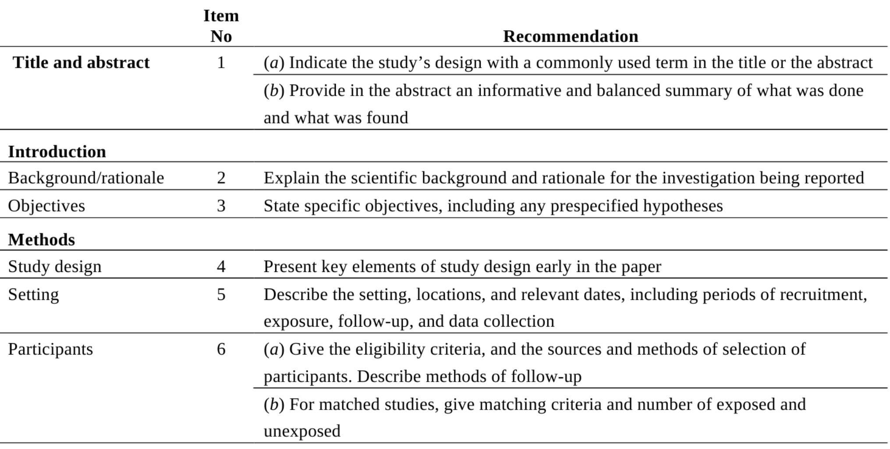


## Éthique & Lois

&nbsp;

:::: {.columns}

::: {.column width="40%"}
>**Comité d'Éthique**<BR>
>**CNIL**<BR>
> **CPP**
:::

::: {.column width="60%"}
 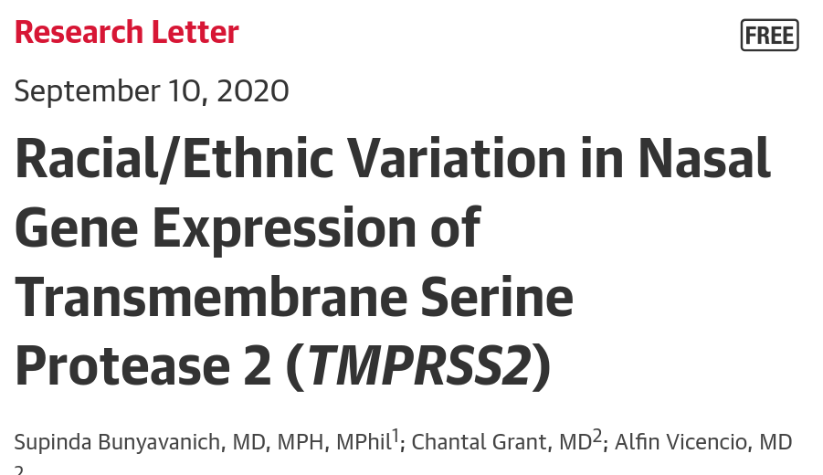
:::
::::
  

## RIPH

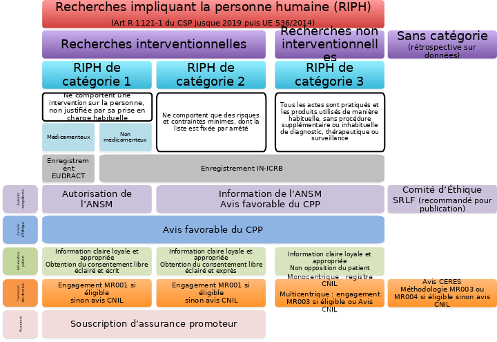

# On rédige

## IMRAD

### Plan immuable


- **I**ntroduction
- **M**ethods
- **R**esults
- **A**nd
- **D**iscussion
 

## IMRAD


## Introduction
### Il était une fois&hellip;

<BR>
  
- Motif du travail au vu de la littérature.<BR>
- Les hypothèses

# Matériel & Méthodes

## Tout doit y être précisé :
  <br>
  
- Type de l'étude
- Population
- Traitements, méthodes diagnostiques&hellip;
- Critères de jugement
- Tests statistiques utilisés

## du  Lourd {.smaller}

**Patient Selection** Twenty-two patients with ARDS were recruited from the intensive care units (ICUs) of the Di Venere, Policlinico (University of Bari), and S. Chiara (University of Pisa) hospitals. The review boards of ;all three hospitals approved the research protocol, and informed consent was obtained from all patients or next of kin. Inclusion criteria were age >18 yr and diagnosis of ARDS. Exclusion criteria were cardiogenic pulmonary edema (clinically suspected or pulmonary artery occlusion pressure > 18 mmHg), history of ventricular fibrillation or tachyarrhythmia, unstable angina or myocardial infarction within the preceding month, preexisting chronic obstructive pulmonary disease, mean arterial pressure
 (MAP) < 65 mmHg (despite attempts to increase blood pressure with fluid and vasopressors, as clinically indicated), anatomic chest wall abnormalities, chest tube with persistent air leak, pregnancy, and intracranial abnormality.<BR>All patients were intubated and ventilated with a Siemens Servo Ventilator 300 (Siemens Elema AB, Solna, Sweden). The investigation was performed in the semirecumbent position after sedation (diazepam, 0.1–0.2mg/kg, and fentanyl, 2–3{ng/Kg) and paralysis (vecuronium, 4–8 mg). A physician not involved in the research aspects of the study was always present to provide patient care.

## La science est reproductible

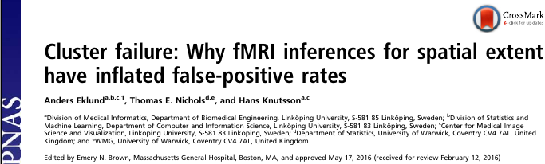

### 40 000 articles invalidés


### ou 3 900&hellip;

# Nombre de patients
<br>
 
## Le calcul doit être fait a priori (*calcul de puissance*).
<br>

**Strict minimum : 30 par groupe**


> *N'a de sens que s'il y a un test principal avec une hypothèse claire*

## Faire du chiffre !
:::{.callout-tip}
## ISIS 2 

Aspirine & reperfusion dans l'IdM en phase aiguë<br>
Lancet 1986

**16 027 cas**
:::

:::{.callout-caution}
## GUSTO I
NEJM 1993

Interêt de la reperfusion précoce dans l'IdM<br>

**41 021 cas**
:::

## Grippe

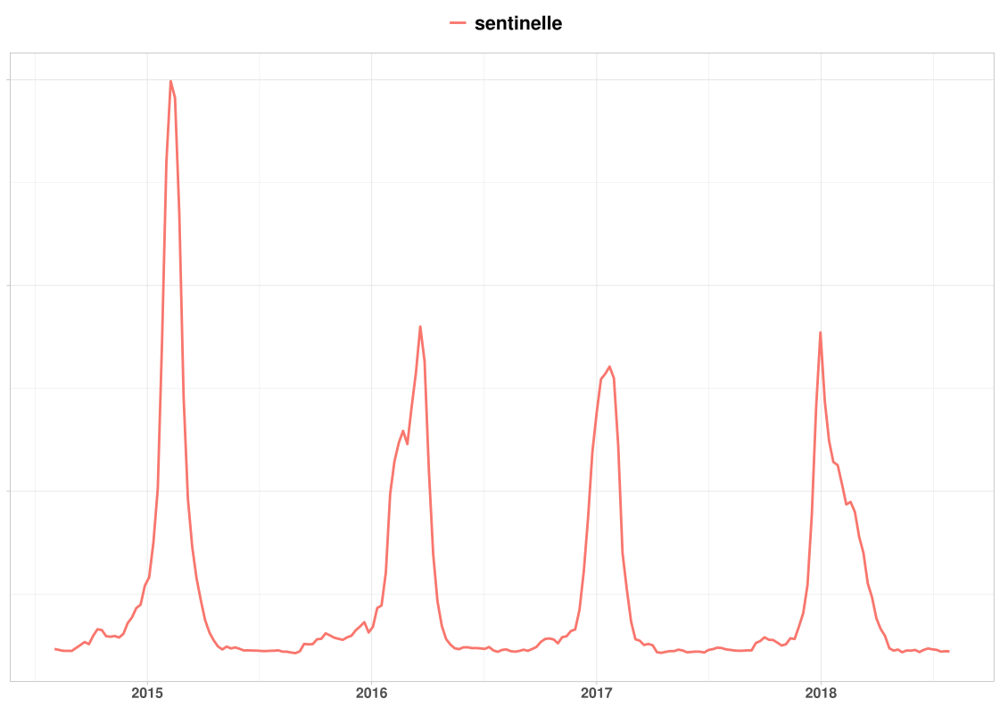


## Grippe

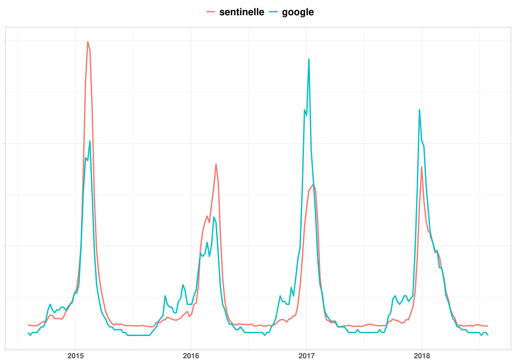


## Définir la population 

### 2 écueils possibles

:::{.callout-tip}
## Population très large

- Tous les patients vus aux urgences pour douleur thoracique
:::	

:::{.callout-warning}
## Population trop serrée
- Patients de 40 à 75 ans,
- douleur rétrosternale gauche <3 h
- troponine > 50 mg/mL
:::

## Les sous groupes ?

> Aucune conclusion ne doit être portée sur un résultat de sous-groupe

&nbsp;

### VS-AI vs CPAP dans l'OAP

- Supériorité globale de la VS-AI;
- Un sous groupe (IdM) s'aggravait en VS-AI&hellip;


*Mehta 1997*


## Traitements utilisés

### Enfin de la clinique !
 
 
- Vérifier si le traitement proposé est conforme à ce que vous attendiez, proche de votre pratique&hellip;
- C'est le protocole que vous appliquerez si l'étude vous convainc.

## Partie statistique {.smaller}

<br>

**Statistics** Data are expressed as mean ± standard deviation of the mean. Data within groups were compared by analysis of variance for repeated measures with a *Bonferroni* correction. If significant (p < 0.05), the values at different experimental conditions were compared with those at baseline with use of a paired t test, as modified by Dunnett. Comparisons of data between groups were performed at each experimental condition by the Fisher exact test for categorical variables and the Wilcoxon test for continuous variables. Regression analysis was performed with the least-squares method. Analysis was carried out with the StatView software package (Abacus, Berkeley, CA).

## Résultats

<br>

### Les résultats,

### Tous les résultats,

### Rien que les résultats

 
## Quelques tableaux
 
- Description de la population
- Comparaison des deux groupes

## Quelques figures
 
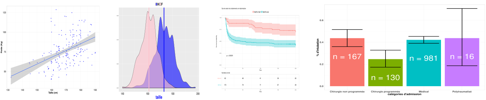


## des petits dessins
```{r g1, fig.dim = c(14, 7), fig.align='center'}
dd <- tt %>% 
  dplyr::select(age,sexe)
dd <- na.omit(dd)  
  ggplot(dd) +
  aes(x = age, fill = sexe) +
  geom_histogram( position = "dodge", color = "black", binwidth = 10) +
 labs(title = "Âge & genre",
 caption = "Âge (ans) & genre des patients",
 x = "ans",
 y = "n") +# Titres des axes
  theme_light() +# Thème simple, idéal pour publication
  theme(
 plot.title = element_text(size = 16),
 axis.title.x = element_text(size = 12),
 axis.title.y = element_text(size = 12),
 axis.text.x = element_text(size = 12),
 axis.text.y = element_text(size = 12),
 legend.position = "right" 
  )
```

## des petits dessins
```{r g1b, fig.dim = c(14, 7), fig.align='center'}
dd <- tt %>% 
  dplyr::select(age,sexe)
dd <- na.omit(dd)  
  ggplot(dd) +
  aes(x = age, fill = sexe) +
  geom_density(alpha = 0.5) +
 labs(title = "Âge & genre",
 caption = "Âge (ans) & genre des patients",
 x = "ans",
 y = "n") +# Titres des axes
  theme_light() +# Thème simple, idéal pour publication
  theme(
 plot.title = element_text(size = 16),
 axis.title.x = element_text(size = 12),
 axis.title.y = element_blank(),
 axis.text.x = element_text(size = 12),
 axis.text.y = element_blank(),
 legend.position = "top" 
  )
```

## des petits dessins

```{r g3, fig.dim = c(14, 7), fig.align='center'}
ggplot(dd) +
  aes(x = sexe, y = age, fill = sexe) +
  geom_violin() +
  geom_boxplot(width = 0.2, fill = "white") +
  labs(
    title = "Âge & genre",
    caption = "Âge (ans) & genre des patients",
    x = "",
    y = "n"
  ) + # Titres des axes
  theme_light() + # Thème simple, idéal pour publication
  theme(
    plot.title = element_text(size = 16),
    axis.title.x = element_blank(),
    axis.title.y = element_text(size = 12),
    axis.text.x = element_text(size = 12),
    axis.text.y = element_text(size = 12),
    legend.position = "none"
  )
```

## des petits dessins
```{r pyr, fig.dim = c(14, 7), fig.align='center'}
pyramid(dd$age,dd$sexe,col.gender = c("pink","cyan"), main = "Pyramide des âges")
```

## &nbsp; {background-color="grey10" background-image="images/graph1.png" background-size="70%"}

## &nbsp; {background-color="grey10" background-image="images/survie.png" background-size="88%"}

## &nbsp; {background-color="grey10" background-image="images/minard.png" background-size="100%"}
 
# Discussion

## Une revue de la littérature

 Doit mettre en évidence les conclusions pratiques de l'étude mais aussi ses **points faibles**
  <br>
  
  
- Mon étude montre que &hellip; 
- Mais elle a ses limites :
   - Patients très âgés;
   - &hellip; 


## Conclusion

::::{.columns}
:::{.column width="48%"}
  <BR>
- Résumé de la discussion<BR>
- Fin ouverte
:::
:::{.column width="48%"}
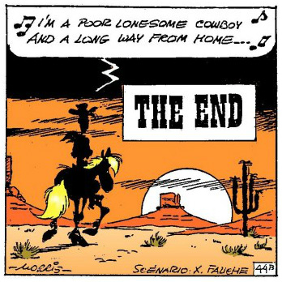
:::
::::


# Des variables ?

## Mais quelle est la question ? {background-color="grey10" background-image="images/42.jpg" background-size="100%"}


# Questions & Variables
  
  <BR>
  
## VARIABLES


> **Variable de tri** Escarre présente<BR> *OUI/NON*
  
> **Variable principale** Alitement prolongé *OUI/NON*
  
> **Variables explicatives** Age, Sexe, IGS II etc.


## Critère de jugement
  
### Ou variable de tri&hellip;

&nbsp;


::::{.columns}
:::{.column width="48%"} 
#### Simple
 
- Vivant / Mort
- Rechute / Pas rechute
:::
:::{.column width="48%"} 
##### Critère composite / score
  
- Rechute + décès
- ± Autonomie&hellip;
:::
::::


# Liste de variables {.smaller}
  
  | |**nom**|**abrégé**|**type**|**valeurs**|
  |--|--|--|--|--|
  |1|Âge du patient|age|entier|18-110|
  | 2|Date d'admission|dateadm|date|dd/mm/yyyy| 
| 3|Sexe|sexe|facteur|F / M|
 |4|BMI |bmi|entier| 10-60 Kg/m<up>2</up>|
 |5|IGS II à l’admission|igsadm|entier|6-150|
 |6|Oxygénothérapie|oxy|entier|0-20 L/min|
 |7|Ventilation invasive|vi|facteur|oui/non|
| 8|Sédation|sedation|facteur|oui/non|
 |9|Curarisation|curarisation|facteur|oui/non/nsp|


## Variables en pratique

### html

&nbsp;

 
::::{.columns}
:::{.column width="48%"} 
```
  <p> Âge
 <input 'NUMBER' 
 name = 'age' 
 min = '18' 
 max = '110'>
  </p> 
```
:::
:::{.column width="48%"} 
<p> Âge
 <input type ='NUMBER' 
  name = 'age' 
  min = '18' 
  max = '110'>
</p> 
:::
::::

## Variables en pratique : R

```{r stud, echo = TRUE}
t.test(age~escarrej, data = tt, var.equal = FALSE)
```

# Organiser son tableau

## Un grand rectangle

- Un seul tableau (*si possible*)
- Variables en colonne, individus/mesures en ligne
- Que les données, pas de calcul etc.
- Une ligne de titre, titres uniques
- Pas de case vide


## Titres, Sujets Variables
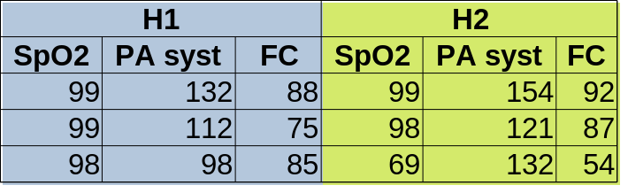
<br>

. . .

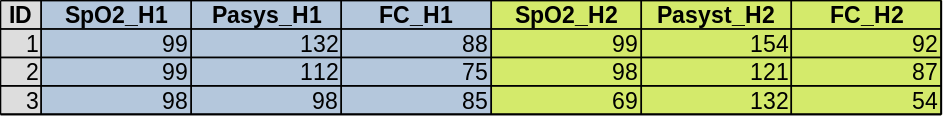

## Titres, Sujets Variables
 

```{r x1, echo = TRUE, eval = FALSE}
t.test(SpO2_H1,SpO2_H2)
```

. . .

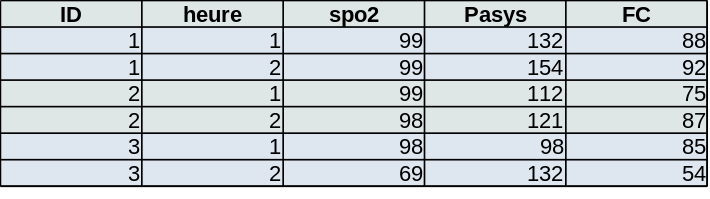
```{r x2, echo = TRUE, eval = FALSE}
t.test(spo2~heure)
```

## Les données : pas si facile...

```{r d1, echo = TRUE, eval = TRUE}
sqrt(2)^2 == 2
```
<HR> 

. . .

```{r echo = FALSE, eval = TRUE}
Norme <- c("Français","Français","USA", "ISO 8601")
Ecriture <- c("25/12/2021","25/12/21","2021-12-25","2021-12-25")
dfx <- data.frame(Norme, Ecriture)
kable(dfx) |> 
 kable_styling(bootstrap_options = "striped", full_width = TRUE,
position = "center")
```


# Que faire des données ?

## Tableau descriptif {.smaller}

```{r}
#| label: tbl-tab1
#| tbl-cap: Table 1

tt |>
  dplyr::select(alite_avant, age, igs, albumine, escarrej) |>
  tbl_summary(by = escarrej, missing = "no") |>
  modify_spanning_header(c("stat_1", "stat_2") ~ "**Escarre**") |>
  modify_header(label ~ "") |>
  add_p() |>
  bold_p() |>
  bold_labels() |>
  as_kable_extra() |>
  kable_styling(bootstrap_options = "striped", full_width = FALSE,
position = "center")
```


## Il n'y a pas que p<5 % ! {.smaller}
::::{.columns} 
:::{.column width="38%"} 
 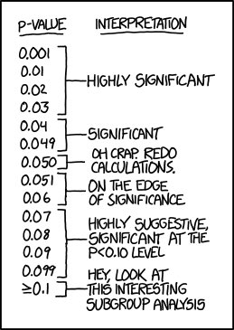
:::
:::{.column width="58%"} 
- Moyennes, écart-type
- % ± Intervalle de confiance
- Médiane, quartiles
 
**Data mining**

- Clustering
- Analyse factorielle
- Machine Learning
:::
::::


## &nbsp;{background-color="grey10" 
   background-image="images/data5.png" 
   background-size="70%"}
   
## &nbsp;{background-color="grey10" 
   background-image="images/claas.png" 
   background-size="80%"}
   
## &nbsp;{background-color="grey10" 
   background-image="images/carte.jpg" 
   background-size="80%"}

## &nbsp;{background-color="grey10" 
   background-image="images/echo.jpg)" 
   background-size="100%"}


## Des tests&hellip;
::::{.columns}
:::{.column width="48%"} 
- t de Student
- $\chi^2$
- test non paramétrique de Wilcoxon
- ANOVA
- Coef de corrélation (Spearman ou Pearson)
- test de Cochran-Mantel-Haenszel
:::
:::{.column width="48%"}
  .small[$$f(x)  = \frac{1}{\sqrt{2 \pi\sigma^{2}}}e^{\frac{-(x-\mu)^2}{2\sigma^{2}}}$$]
 
.small[$$t^{n-1}_{1-\alpha/2} = \frac{|m_1-m_2|}{S^2\sqrt{\frac{1}{n_1}+\frac{1}{n_2}}}$$]
 
$$\xi_{CMH} = { [ {\sum_{i=1}^K (A_i- {N_{1i} M_{1i}\over T_i}):::^2 } \over {\sum_{i=1}^K {N_{1i}N_{2i}M_{1i}M_{2i} \over T_i^2(T_i-1)}}}$$
:::
::::

## Analyse simple
  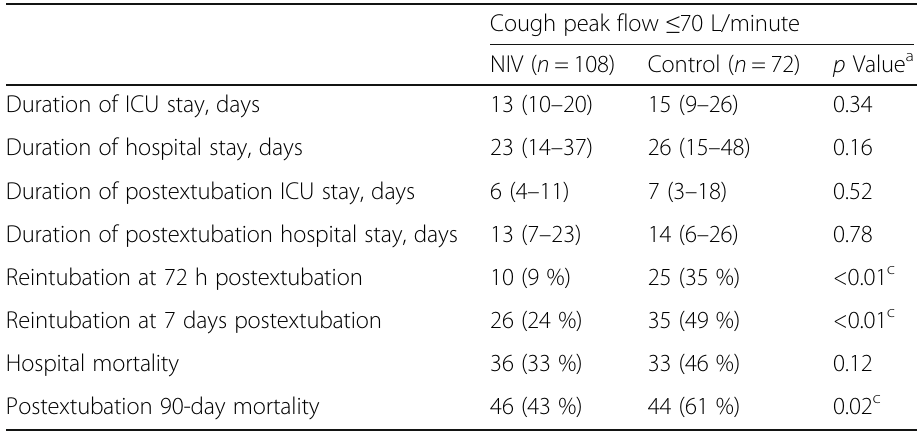


  


  

## Un ensemble de données
  
#### Régression (logistique ou linéaire ou &hellip;)
  
  <br>
  
  $$\text{escarre} = f_1(\text{age})+f_2(\text{alitement})+f_3(\text{igs2})+...+\varepsilon$$


  .center[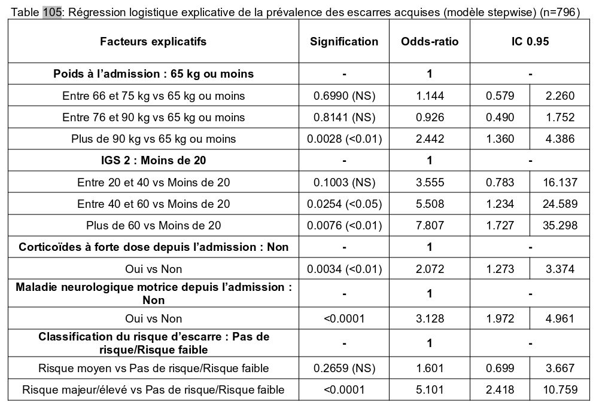]

## Un peu de recul&hellip;
  
  
$$IC_{95}= p \pm z_{\alpha/2}\sqrt{\frac{p(1-p)}{n}}$$
  
  <br>
$$\mathbb{P}\left(-z_{\alpha/2} \leq
  \frac{\frac{X}{n}-p}{\sqrt{\frac{p(1-p)}{n}}} \leq
  z_{\alpha/2}\right)\thickapprox 1-\alpha$$
  

# Un peu de recul&hellip;
$$IC_{95}= p \pm z_{\alpha/2}\sqrt{\frac{p(1-p)}{n}}$$
  
  <br>
  
  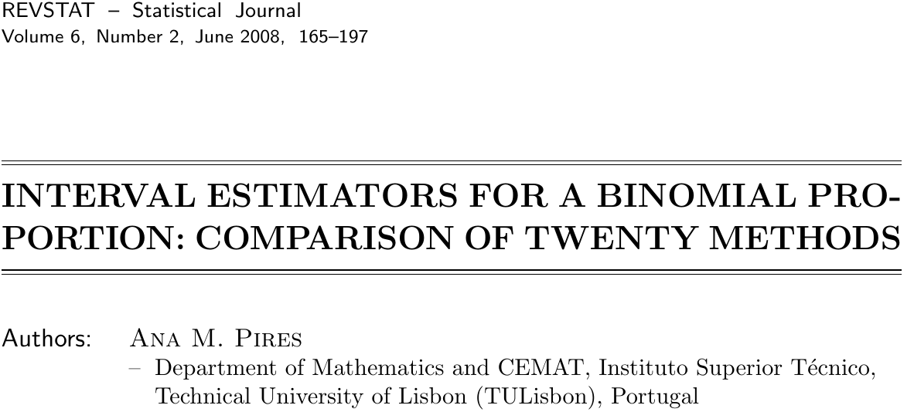

## p< 5 \ ???
  .right[]

## p< 5 \ ???
  .right[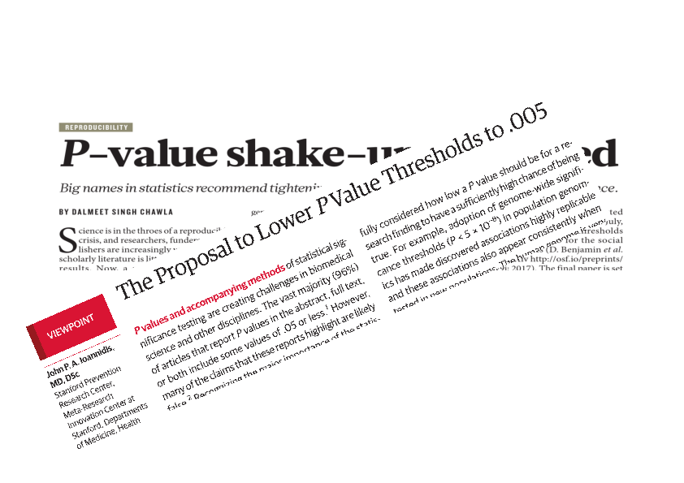]

## p< 5 \ ???
  .right[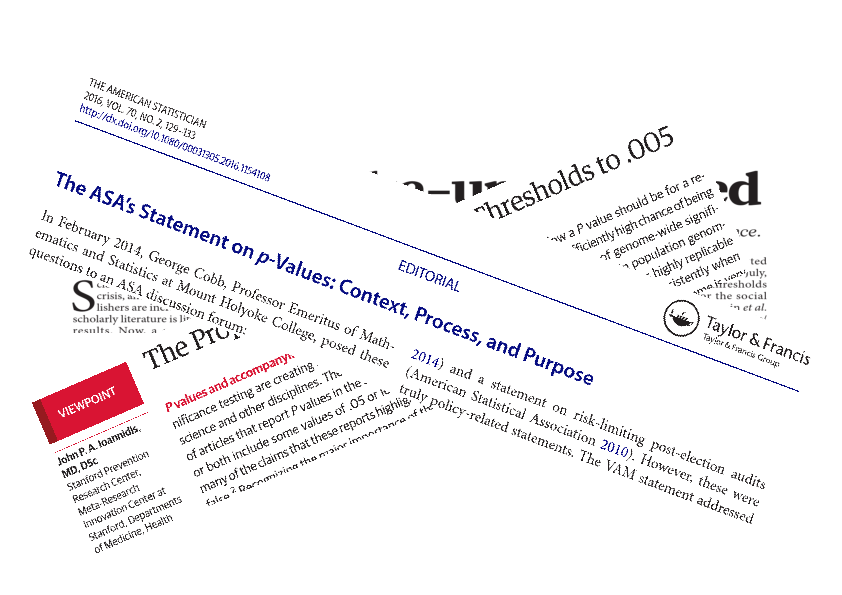]

## CONCLUSION 1
  .center[]

# CONCLUSION 2
  
  .center[]

### Du bon sens
### Se méfier de tout


## Il existe trois types de menteurs : 
  
  <BR>
  
### les menteurs
### les fieffés menteurs
### et les .rouge[statisticiens]
